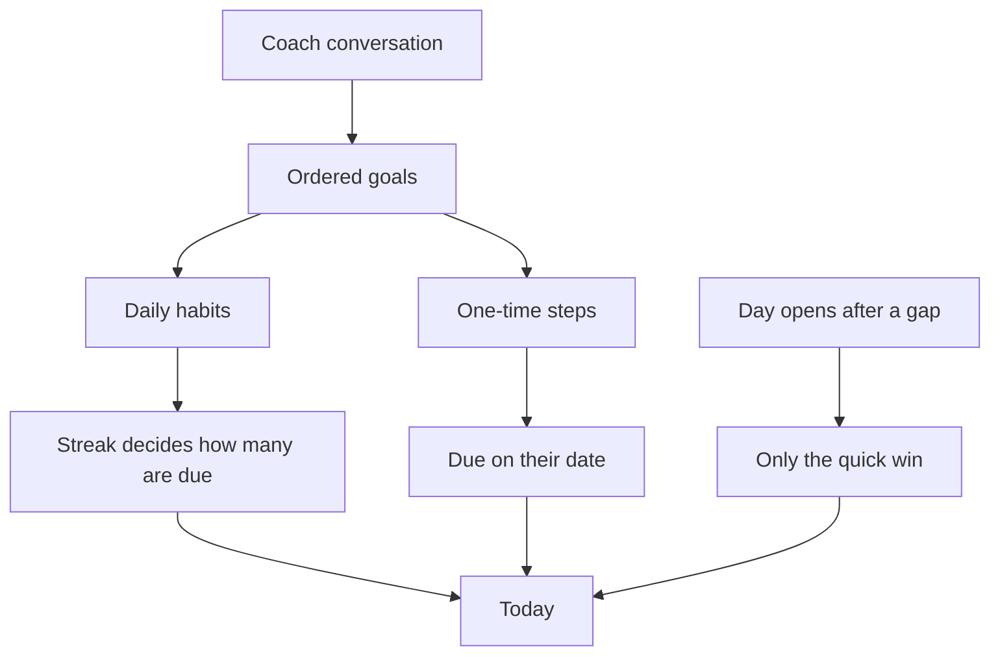

# Premium coach

The coach keeps the user on track for every identity. The same rules apply to Disciplined, Financially Independent, Healthy, and the rest. Nothing in the server picks "one-time" or "daily" from the identity name. The coach decides, from what the user says and how they have been showing up.

The same person might get a mix. One-time steps when the work is a sequence:

- Today: write down the skills you have.
- Next day: make a business plan. Think of a name.
- Day after: create the social accounts. Post a reel.

Repeating actions when the work is a practice. If they are just starting, or the streak is broken, the first day is one quick win. After they keep showing up, one day can hold make the bed, read 10 pages, walk for 20 minutes, prepare lunch, and create a video. A video, a business, or any other project is included only if they said they want to work on it.

A broken streak reduces that list back to the quick win. The other goals stay in the plan and return one at a time. Closed days stay. Free users keep the catalog path and the existing "Coming soon" line.

This writes the transformation that already exists. [implementation.md](implementation.md) already reserves `origin`, `rationale`, `context`, phases, and planned commitments. No new goal or message tables.

## Conversation and proposals

New routes, signed in, Pro only (`plan=pro` and `subscription_status` in `active`, `trialing`, or `past_due`). Anyone else gets `403`. If `AI_API_KEY` is empty, `POST /api/coach/messages` returns `503`, the same pattern as Stripe in [src/core/config.py](../src/core/config.py). `POST /api/coach/apply` does not call the model, so a missing key does not block it.

- `POST /api/coach/messages` with `{ "message": "..." }` appends the turn to `transformations.context`, calls the model with the chosen identities, the stored idea, the streak, recent closed days, and today's open goals, and returns the reply plus a proposal when the model has one.
- `POST /api/coach/apply` applies the proposal already stored on the server. The client cannot send goal text of its own.

The model stays short. It asks what they can already do and what they want to work on, then proposes goals in their words. For every identity it chooses the shape: a repeating action is `daily` or specific weekdays, and a step that should happen once is `once` with a date. One plan can contain both. The first goal is the smallest quick win when they are starting or the streak is thin. Later ones are harder or optional. It does not add a project they did not mention. Invalid JSON does not write anything.

A day holds at most 5 goals across identities, and at least 1 when anything is due. The server trims a proposal above 5. `context.idea` stores the thread in their words. `context.statement` holds one personal line, used as `statement` by [src/services/transformation.py](../src/services/transformation.py) when it is set. Accepting a proposal appends the reason to `rationale` and sets `origin` to `adaptive`.

The client is a small function over `requests` to OpenAI chat completions, with `AI_MODEL` overridable. Tests mock that function and never call the network.

## What a confirmed plan changes

Planned commitments gain a `once` recurrence and a `due_on` date. A migration extends the existing recurrence check. A one-time goal is due only on that date. A daily goal is the habit they repeat.

The coach's goals are ordered. Position 1 is the quick win. Adaptive paths do not use the catalog earn-and-lose count. They use the streak instead.

`commitment_streak` is 0 on the first day and after a gap, because a missed calendar day already resets it when the next day opens. The number of repeating goals due that day is `min(5, streak + 1)`:

- Streak 0: make the bed.
- Streak 1: make the bed, read 10 pages.
- Streak 4 or more: the full list, up to 5.

Goals past that count are not due and are not misses. They come back as the streak grows. One-time goals sit in the same order. If a reduced day cannot fit one, its date slides to the next day instead of counting as a miss.

A confirmed conversation can set today's count anywhere from 1 to 5, which overrides the streak for that day. "I don't feel like it" can leave the quick win. "Give me the full list" can show all five even if the streak is short.

On apply, replace coach commitments that are still ahead. Leave anything already stored on a closed day. Rebuild the open day. Catalog paths keep the three-day and two-day rule. Later phases stay on Journey. Changing identity or direction still recopies the catalog for that path.

Tomorrow and Coming up show the goals the next day would include at the streak this close would produce, so Day Complete can name what is next. If they miss the day, tomorrow falls back to the quick win.

## Adjust today

"I'm exhausted" or "I only have 20 minutes" is a temporary change. The proposal type is `today`. Apply changes the open day only: fewer goals, or a smaller title, such as 10 pages becoming 5. Future goals stay. A closed day stays. Tomorrow uses the streak rule again unless they confirm a new plan.

"I don't want to work on this anymore" is a `plan` proposal. That is the one that rewrites unfinished goals.

The coach distinguishes a lasting goal from today's implementation of a goal that already exists, and from advice that is not stored. The user does not need a new goal every time they ask for a meal, a workout, or another specific action. When the request supports an existing goal, the coach recommends the concrete action and may set it as today's implementation. It does not refuse a reasonable request because it is not a new goal.

There is no second route. Adjust today opens the same coach. Short chips only prefill the message.

A gap still shows the quick win, with no lecture. If the user explains the miss, the coach may propose a smaller today, or a new plan if they want the change to last. One miss is not a pattern. The model may mention a repeated skip only when several recent days show it. Nothing about that pattern is stored.

## Context

`context` is one JSON object. The server merges a validated update and drops unknown keys.

- `idea` and `statement`
- `constraints`, `preferences`, `skills`, and `obligations` as short lists of things the user actually said
- `availability`, such as weekday and weekend minutes
- the recent transcript and the stored proposal

`obligations` means facts such as "works 9 to 5". It does not mean planned commitments. The path-level `rationale` stays one appended reason. Each goal can carry its own short `reason`, shown as one line under the action.

Identity, outcome, milestone, and action use the path, `context.idea`, `objective`, and the action title. There is no separate hierarchy table.

## When they change their mind

A new thought rewrites the unfinished plan. Closed snapshots stay. An unfinished one-time step can move to today. Done and skipped rows stay. "I showed up" still waits until every goal due today is done or skipped.

## Screen

Today shows a coach card under the day's promises. Pro gets "Talk with your coach" and "Adjust today". Free gets a locked card. Unlock opens the Pro prompt. Journey and Progress keep the existing "Coming soon" line.

The coach is one conversation, opened from either button. Adjust today stays in that chat and only prefills the field. The thread shows the recent turns, the coach on the left and the user on the right. A proposal sits in the thread: the quick win first, then what joins as they show up, with the one-time date and one reason line. "Start this plan" confirms it. "Change it" stays in the same chat.

Voice stays short, with no praise and no guilt. "Start with the bed. The rest waits until you've shown up."

When this is built, the routes, `once` / `due_on`, and the streak prefix also belong in [api.md](api.md) and [domain.md](domain.md). `AI_API_KEY` and `AI_MODEL` belong in [implementation.md](implementation.md).

## Tests

- A free account, and a Pro account whose status is outside `active`, `trialing`, and `past_due`, receives `403`. Trialing, active, and past due may call the coach. A missing key receives `503`.
- The server does not branch on identity. A mocked reply can mix one-time goals and daily goals on any identity. Invalid JSON does not write. A sixth goal is trimmed.
- One-time goals are due only on their date. Five daily goals show only the first when the streak is 0, two when the streak is 1, all five after four closed days, and only the first again after a gap. The hidden ones are not misses.
- A today adjustment changes the open day only. Future goals remain.
- Skills and constraints the user stated are still there on the next turn. A fact they did not state is not stored.
- A confirmed "full list" can show 5 goals on a short streak.
- A catalog account still earns goals with the three-day and two-day rule.
