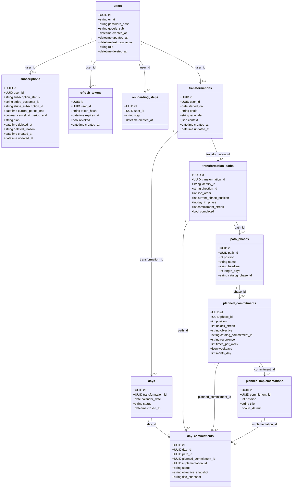

# Database UML and ChatGPT prompt

Source of truth: SQLAlchemy models in `src/models` and the rules in [domain.md](domain.md). Column notes are also in [entities.md](entities.md).

App rules that are stricter than the foreign keys: one user has one subscription (created at signup), one transformation, and one or two paths. Each free path has four phases of 14 `length_days`. `day_commitments.path_id`, `planned_commitment_id`, and `implementation_id` are nullable and set to null if the plan row is removed, so a closed day keeps `objective_snapshot` and `title_snapshot`.

## UML



## ChatGPT prompt

Paste this, then add your question at the end.

```
You are helping me with YouAreUnstoppable. Use only the schema and rules below. Do not invent tables, columns, or relationships. If a number is computed and not stored, say so.

Product
- One user has one transformation. A transformation is a copy of a catalog path, not a pointer at a shared catalog. There is no catalog table.
- The user picks one or two identities, and one direction for each. Free copies phases and commitments in at start.
- A day is a calendar date. It is open until the user shows up, then closed. Closed days keep the objective and title they were given when the day opened.
- A planned commitment has an objective and one or more implementations. Skip settles that occurrence. It does not delete the schedule and it does not count as done.
- The path starts with one active goal. Three progress days in a row add the next goal. One empty day breaks the run. Two empty days in a row remove the most recently added goal. The count never drops below one.
- "I showed up" closes the day when every due commitment is done or skipped, and advances every path.
- promises_kept is the count of closed days. It is not stored. Misses, skips, completion, momentum, and the year intensity view (0, 1, or 2 per date) are computed from days and day_commitments. They are not columns.
- commitment_streak is stored on the path. It increments once when a close completed at least one due goal, and resets to 0 when a close completed none, after a gap, or when the path is replaced. It is not shown. Catalog scheduling does not read it. Adaptive scheduling uses min(5, streak + 1) repeating goals.
- Reset deletes the transformation, its paths, and its days. The account stays.
- origin is catalog or adaptive. A confirmed coach plan sets adaptive and appends rationale. context holds the coach facts, the last eight transcript turns, the stored proposal, and a one-day override. There is no goal, message, or pattern table.

Tables (PostgreSQL via SQLAlchemy; ids are UUIDs)

users
- id PK
- email string(320) unique, required
- password_hash string(255) nullable
- google_sub string(255) unique, nullable
- created_at, updated_at timestamptz
- last_connection timestamptz nullable
- role: user | admin (default user)
- deleted_at timestamptz nullable. A set deleted_at cannot sign in.

subscriptions  (one per user)
- id PK
- user_id FK users.id, unique, required
- subscription_status string(32) nullable
- stripe_customer_id string(255) unique, nullable
- stripe_subscription_id string(255) unique, nullable
- current_period_end timestamptz nullable
- cancel_at_period_end boolean, default false. A scheduled cancel keeps plan pro until Stripe deletes the subscription.
- plan: free | pro (default free). Webhooks set pro when Stripe status is active, trialing, or past_due. customer.subscription.deleted sets plan free, clears stripe_subscription_id and cancel_at_period_end, and does not set deleted_at. Signup does not call Stripe.
- deleted_at timestamptz nullable
- deleted_reason text nullable. Check: deleted_reason is null, or deleted_at is set.
- created_at, updated_at timestamptz

refresh_tokens
- id PK
- user_id FK users.id, indexed, required
- token_hash string(64) unique, required
- expires_at timestamptz required
- revoked bool default false
- created_at timestamptz

onboarding_steps
- id PK
- user_id FK users.id ON DELETE CASCADE, required
- step: begin | identity | direction
- created_at timestamptz
- Unique (user_id, step)

transformations  (one per user)
- id PK
- user_id FK users.id, unique, required
- started_on date required
- origin: catalog | adaptive (default catalog). hybrid is not allowed.
- rationale text nullable
- context json nullable
- created_at, updated_at timestamptz

transformation_paths
- id PK
- transformation_id FK transformations.id ON DELETE CASCADE, required
- identity_id string(64), direction_id string(64)
- sort_order int
- current_phase_position int default 0, check >= 0
- day_in_phase int default 1, check >= 1
- commitment_streak int default 0, check >= 0
- completed bool default false
- Unique (transformation_id, identity_id)
- App rule: 1 or 2 paths. A new or changed path is copied again at day 1 with commitment_streak 0. An unchanged identity and direction keep phase day and streak.

path_phases
- id PK
- path_id FK transformation_paths.id ON DELETE CASCADE, required
- position int
- name string(120), headline string(120)
- length_days int, check >= 1. Free phases are 14.
- catalog_phase_id string(160) nullable
- Unique (path_id, position)
- App rule: four phases. After the last day of a phase, the path moves to day 1 of the next phase. After the last phase, it stays and completed is true. A missed calendar day does not consume a phase day.

planned_commitments
- id PK
- phase_id FK path_phases.id ON DELETE CASCADE, required
- position int
- unlock_streak int, check >= 0
- objective text required
- catalog_commitment_id string(200) nullable
- recurrence: daily | times_per_week | weekly | monthly | once
- due_on date nullable. Required when recurrence is once, otherwise null
- reason text nullable
- times_per_week int nullable, check null or 1..7
- weekdays json, list of ints, Monday = 0 through Sunday = 6
- month_day int nullable, check null or 1..28
- Unique (phase_id, position)
- weekly keeps one weekday. times_per_week keeps exactly that many weekdays. monthly uses month_day. daily is due every day. once is due only on due_on.
- A weekly, monthly, or not-yet-due one-time commitment is not a miss. Adaptive goals past the streak prefix are not misses.

planned_implementations
- id PK
- commitment_id FK planned_commitments.id ON DELETE CASCADE, required
- position int
- title text required
- is_default bool default false
- Unique (commitment_id, position)

days
- id PK
- transformation_id FK transformations.id ON DELETE CASCADE, required
- calendar_date date required
- status: open | closed (default open)
- closed_at timestamptz nullable
- Unique (transformation_id, calendar_date)
- The open day includes every active goal due that date. Changing the schedule updates an open day. A closed day is not rewritten.

day_commitments
- id PK
- day_id FK days.id ON DELETE CASCADE, required
- path_id FK transformation_paths.id ON DELETE SET NULL, nullable
- planned_commitment_id FK planned_commitments.id ON DELETE SET NULL, nullable
- implementation_id FK planned_implementations.id ON DELETE SET NULL, nullable
- status: open | done | skipped (default open)
- objective_snapshot text required
- title_snapshot text required

Delete behavior
- Deleting a user cascades onboarding_steps only. Subscriptions, refresh tokens, and the transformation do not declare ON DELETE CASCADE.
- Deleting a transformation cascades paths, phases, planned commitments, implementations, days, and day commitments.
- Removing a path, planned commitment, or implementation nulls those ids on day_commitments. Snapshots remain.

My question:
```
